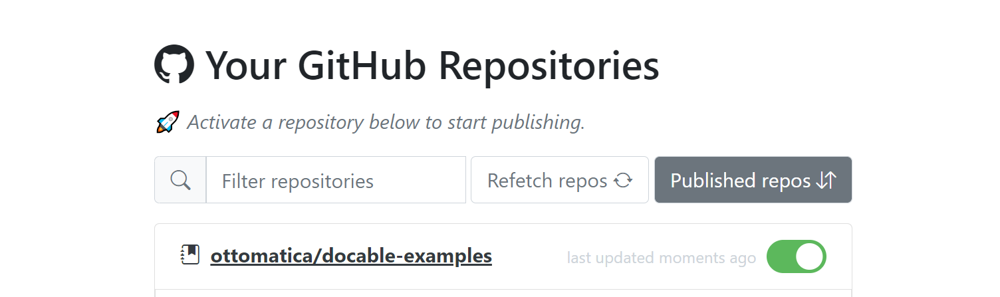

> 🚨 If you just landed on this page and you're not sure what a Docable notebook is, please take a look at [docable.cloud](https://docable.cloud/) or the project's [readme](https://github.com/ottomatica/docable-notebooks). This repository contains an onboarding guild for how to _use_ Docable.

# docable-starter-template

Docable empowers you to write and publish your CS course content, tutorials, blog posts as an advanced interactive document on [`https://docable.cloud/`](https://docable.cloud/). Follow this short guide for a quick onboarding and publish your first Docable notebook in the next 10 minutes ⏲.

Follow these three simple steps:
- 📚 [Create a repo for your notebook](#-create-repository-for-your-notebook)
- ✍ [Write your document](#-write-your-notebook)
- 🚀 [Publish your document](#-publish)

## 📚 Create repository for your notebook

[Click here](https://github.com/ottomatica/docable-starter-template/generate) to use this repository as a _template_ for your first notebook, or alternatively [fork it](https://github.com/ottomatica/docable-starter-template/fork).

Each Docable notebook is managed and stored in its own GitHub repository. Think of a GitHub repository as the whole notebook 📒 and its markdown files as the pages of the notebook 📄. You can create a new repo or use one of your existing ones. However, for this quick onboarding guide we recommend [using this repository as a template](https://github.com/ottomatica/docable-starter-template/generate) because it already contains a few example notebooks which will be useful to use as a starting point.

## ✍ Write your notebook

After creating your GitHub repository, you're ready to start writing your first notebook.
First, clone your repository and then create a markdown file using the code editor of your choice. 

```bash
git clone https://github.com/<USERNAME>/docable-starter-template
cd docable-starter-template
code starter-notebook.md # we're using VS Code here, but feel free to use anything else
```

👉 We included a [`starter-notebook.md`](./starter-notebook.md) in this repository. It includes explaination of the structure of a notebook file, and the supported content.

## 🚀 Publish

[Login to `https://docable.cloud`](https://docable.cloud/login) using your GitHub account. 

> ❕ _If it's your first time using `docable.cloud`, you will see a list of permissions we need to be able to create your account. Please read them and accept to continue._

<p align="center">
  
</p>

After logging in, you will see a list of your repositories (first login needs to fetch your repos, so it may take few seconds to do that). You can then enable the repositories you want to publish by clicking on the toggle switches on the right. Clicking on the repository name will open the published notebook, which will be hosted at `https://docable.cloud/<REPO_OWNER>/<REPO_NAME>`

All of your new commits in this GitHub repository will be automatically published in the future, until you disable the publishing toggle switch again.